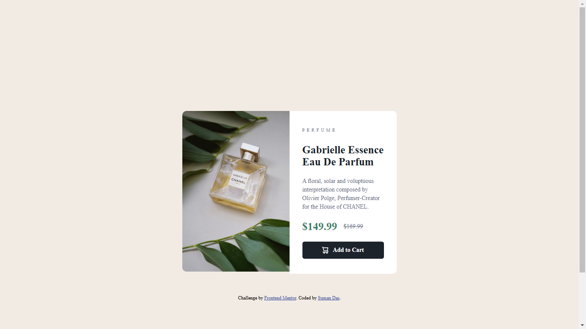

# Frontend Mentor - Product preview card component solution

This is a solution to the [Product preview card component challenge on Frontend Mentor](https://www.frontendmentor.io/challenges/product-preview-card-component-GO7UmttRfa). Frontend Mentor challenges help you improve your coding skills by building realistic projects.

## Table of contents

- [Overview](#overview)
  - [Screenshot](#screenshot)
  - [Links](#links)
- [My process](#my-process)
  - [Built with](#built-with)
  - [What I learned](#what-i-learned)
  - [Continued development](#continued-development)
- [Author](#author)

## Overview

### Screenshot

### Links

- Solution URL: [https://github.com/webdevsuman/product-preview-card](https://github.com/webdevsuman/product-preview-card)
- Live Site URL: [https://webdevsuman.github.io/product-preview-card/](https://webdevsuman.github.io/product-preview-card/)

## My process

1. Structure with semantic HTML
2. Giving a background colour to the body
3. Align the components
4. Giving the elements right size
5. Making the page responsive
6. Giving Elements some colour and border
7. Uploading to Github
8. Making a Readme file and push it to git

### Built with

- Semantic HTML5 markup
- CSS custom properties
- CSS Grid
- Flexbox
- Media query
- Google fonts

### What I learned

- Making image responsive
- Giving border radius to specific corner

### Continued development

## Author

- Website - [Suman Das](https://github.com/webdevsuman/)
- Frontend Mentor - [@webdevsuman](https://www.frontendmentor.io/profile/webdevsuman)
